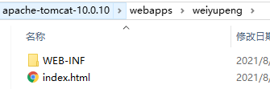

# JavaWeb

## 1 基本概念

### 1.1 前言

web 开发：

+ web 网页 资源的访问
  

+ 静态 web：
  + html css 
  + 提供给所有人看的数据始终不会变化
    

+ 动态 web
    + 提供给所有人看到的数据都不一样，每个人看到的信息也会发生改变
    + servlet jsp asp php
    

在 java 中，动态 web 资源开发的技术统称为 JavaWeb

### 1.2 web 应用程序

可以提供浏览器访问的程序

+ a.html b.html ... 多个 web 资源，这些 web 资源可以被外界访问，对外界提供服务


+ URL 统一资源定位符


+ 这些统一的 web 资源会被放到一个文件夹下 --> web 应用 --> tomcat 服务器


+ 一个 web 应用由多部分组成
    + html css js
    + jsp servlet
    + java 程序
    + jar 包
    + properties
    

+ web 程序写完后需要服务器统一管理才能被外部访问


### 1.3 静态 web

+ *.htm *.html 能通过浏览器直接读取

+ 请求 request ~ 响应 response

+ 缺点
    + web 页面无法动态更新，所有用户看到的都是同一个页面
        + 轮播图，点击特效：伪动态
        + javaScript
        + VBScript
    + 无法和数据库交互（数据无法持久化，用户无法交互），注册都费劲
    

### 1.4 动态 web

页面会动态展示，千人千面

+ 缺点
    + 如果 web 动态资源错误，我们需要重新编写后台程序，重新发布，停机维护
    

+ 优点
    + 可以动态更新
    + 可以与数据库交互，数据持久化（用户信息、商品信息 ...）
  
  
## 2 web 服务器

### 2.1 几个技术

+ ASP：在 html 中嵌入了 VB 的脚本
```html
<h1>
    <% java 代码 %>
</h1>
```
+ C#


+ IIS


+ php：开发速度快，功能强大，跨平台，代码很简单，缺点是无法承载大访问量


+ JSP / Servlet
    + sun 公司主推的 bs 架构 
    + 基于 java 语言
    + 可以承载高并发高可用高性能
    + 语法像 ASP
    

### 2.2 web 服务器

是一种被动的操作，用来处理用户的一些请求和给用户一些响应信息

+ IIS
  
微软的，windows 中自带的


+ Tomcat (>^ω^<)

Apache、免费、性能稳定、处理静态和动态、最新版本为 10.0

下载 tomcat：
1. 安装 / 解压
2. 了解配置文件和目录结构
3. 了解它的作用

## 3 Tomcat

### 3.1 安装

[tomcat 官网](http://tomcat.apache.org/)

[download tomcat10](https://tomcat.apache.org/download-10.cgi)

这里是 windows 系统，所以下载 [64-bit Windows zip (pgp, sha512)](https://mirrors.tuna.tsinghua.edu.cn/apache/tomcat/tomcat-10/v10.0.10/bin/apache-tomcat-10.0.10-windows-x64.zip)

无需安装 解压之后直接就能使用

### 3.2 启动

+ 启动

apache-tomcat-10.0.10/bin/startup.bat

成功访问 http://localhost:8080/ 说明 启动完毕

但是启动之后控制台出现乱码，默认不支持汉字？

将 apache-tomcat-10.0.10/conf/logging.properties 中所有的的 `encoding = UTF-8` 的都改为 `encoding = GBK`，问题解决

+ 关闭

apache-tomcat-10.0.10/bin/shutdown.bat 或 直接点 × 关闭 tomcat 窗口

+ 可能遇到的问题
    + 闪退
        1. java 环境变量没有配置
        2. 需要配置兼容性
    + 乱码：已解决

### 3.3 配置

核心配置文件：apache-tomcat-10.0.10/conf/server.xml

可以配置：
1. host 和 webapp
```xml
<Host name="localhost"  appBase="webapps"
            unpackWARs="true" autoDeploy="true" />
```
系统文件 etc/hosts 也要对应添加修改

2. port
```xml
<Connector port="8080" protocol="HTTP/1.1"
               connectionTimeout="20000"
               redirectPort="8443" />
```

3. 配置环境变量

### 3.4 发布一个 web 网站

+ 静态网页




+ 将自己写的网站，放到服务器（tomcat）中指定的 web 应用的文件夹（webapps）下，就可以访问了


+ 目录结构
```bash
--webapps
  --root
  --weiyupeng
    --WEB-INF
      --classes (*.java)
      --lib (dependencies.jar)
      --web.xml
    --index.html (默认的首页)
    --*.html
    --*.jsp
    --static
      --css
        --style.css
      --js
      --img
```

## 4 HTTP

### 4.1 what

超文本传输协议，一个简单的请求-响应协议，通常运行在 TCP 之上

+ HTTPS

安全


### 4.2 http 1.0 和 1.1

+ 1.0

客户端与服务器连接后，只能获取一个 web 资源，然后断开连接


+ 1.1

能获取多个 web 资源，长连接


### 4.3 request

+ 客户端 -- 发请求 -- 服务器

```bash
Request URL: https://www.baidu.com/ # 地址
Request Method: GET # 方法 GET POST
Status Code: 200 OK # 状态码
Remote Address: 110.242.68.3:443 # 地址:端口
Referrer Policy: no-referrer-when-downgrade
```

```bash
Accept: text/html,application/xhtml+xml,application/xml;q=0.9,image/webp,image/apng,*/*;q=0.8,application/signed-exchange;v=b3
Accept-Encoding: gzip, deflate, br # 编码方式
Accept-Language: zh-CN,zh;q=0.9  # 语言地区
Cache-Control: max-age=0
Connection: keep-alive # 长连接
Cookie: BIDUPSID=9D91478CB9860241F2EA424D1952CDB0; PSTM=1567840620; H_WISE_SIDS=148078_152522_155383_149355_152055_156818_156287_150775_154258_155985_148867_155225_154804_157765_153628_156622_157263_146870_150772_156388_156580_156516_127969_154413_154174_155962_152982_146732_155791_131423_155835_157699_128700_157781_155529_107314_156561_156945_155344_156745_157858_157790_144966_153535_154214_157814_156099_158089_156293_156442_153448_158126_157696_154639_152310_154353_110085_157006; hide_hotsearch=1; sug=3; ORIGIN=2; bdime=0; __yjs_duid=1_2bd10527b8c90f0afd0f46f979ee9e5d1618033482207; BAIDUID=FE413E712CF6CA121B6D802425FFFD4D:FG=1; MCITY=-%3A; BD_UPN=12314753; BDUSS=hOSnFjUXVnLWx0QjFvflBZWjM4bk1qU2RGT0NEd1puMmxxM2ZMTGRDNkdiQlJoRVFBQUFBJCQAAAAAAAAAAAEAAAAyCQFLS3JQZXJmZWN0AAAAAAAAAAAAAAAAAAAAAAAAAAAAAAAAAAAAAAAAAAAAAAAAAAAAAAAAAAAAAAAAAAAAAAAAAIbf7GCG3-xgUE; BDUSS_BFESS=hOSnFjUXVnLWx0QjFvflBZWjM4bk1qU2RGT0NEd1puMmxxM2ZMTGRDNkdiQlJoRVFBQUFBJCQAAAAAAAAAAAEAAAAyCQFLS3JQZXJmZWN0AAAAAAAAAAAAAAAAAAAAAAAAAAAAAAAAAAAAAAAAAAAAAAAAAAAAAAAAAAAAAAAAAAAAAAAAAIbf7GCG3-xgUE; BDSFRCVID_BFESS=mKuOJeC62ukSa6JHLUWFuy7VqUWP-vRTH6aoe28GcLucW1JvfBdCEG0PVU8g0Ku-JGz_ogKK0mOTHUkF_2uxOjjg8UtVJeC6EG0Ptf8g0M5; H_BDCLCKID_SF_BFESS=tb-qVCLKJKvhDRTvhCcjh-FSMgTBKI62aKDsWlvaBhcqEIL45tR6-jKpy-vPLM5tMRvpQx56LT6-VxbSj4QobjjbQUbr-4JUtmQq0qoe0h5nhMJK3j7JDMP0qt6xhqRy523ion6vQpnljpQ3DRoWXPIqbN7P-p5Z5mAqKl0MLPbtbb0xXj_0-nDSHH8qt6-H3e; BDORZ=B490B5EBF6F3CD402E515D22BCDA1598; __yjs_st=2_NzRmMzI4NThiM2QyZTVhNDYyNDUzY2UwNzg4ZGMxMWE2ZTc1NzYyZWE1ZTIxNzBlYTBmZGFmMGM3NzUxY2I2MTFiMTQxYjYyOTEyYzRkOGVmNTkwODNlNzU5MjE2ZTRjNDU1OGJhOTA1ZmYzZmNjYTQxMGJlYzEyMTdiZWMzZTU5YWVmNTA1MWYzNjZiZmY4ZjFmMTg2YjQwZjE1MzJjYzRhZTgyNGI3NmI1YTViZjcxZmZjYzZjNzJjYzZjOTkwOWEwM2UzN2ZlNTQ3YTFjYjM5OWE0MGU2OTU4M2JmYTQxOWVhMmI4ZmM5NmRlNDIzZmRiZjFiNzIzN2U5NTliMGQ5OWQ4YWE5NmI1MDVhZTMxMzc1NmY1YjQzOWY2ZDk2XzdfMzhlYTA3YzU=; BD_HOME=1; H_PS_PSSID=34436_31253_34377_33848_34449_34073_34092_26350_34245_34368; sugstore=0; BA_HECTOR=252h2k81210h00aklh1ghq0a60q
Host: www.baidu.com # 主机
Sec-Fetch-Mode: navigate
Sec-Fetch-Site: none
Sec-Fetch-User: ?1
Upgrade-Insecure-Requests: 1
User-Agent: Mozilla/5.0 (Windows NT 10.0; Win64; x64) AppleWebKit/537.36 (KHTML, like Gecko) Chrome/77.0.3865.90 Safari/537.36
```
+ 请求行

请求方式 GET POST HEAD DELETE PUT TRACE ...

GET：携带的参数较少，大小有限制，会在 URL 地址栏显示数据内容，不安全但高效

POST：携带的参数较多，大小没有限制，不会在 URL 地址栏显示数据内容，安全

+ 消息头

```bash
Accept: 告诉浏览器支持的数据类型
Accept-Encoding: 支持哪种编码格式 GBK UTF-8 GB2312 ISO8859-1
Accept-Language: 语言环境
Cache-Control: 缓存控制
Connection: 请求完成后是断开还是保持连接
...
```

### 4.4 request

+ 服务器 -- 发响应 -- 客户端

```bash
Bdpagetype: 2
Bdqid: 0xfb508de000022e0c
Cache-Control: private # 缓存控制
Connection: keep-alive # 连接 保持长连接
Content-Encoding: gzip # 压缩方式
Content-Type: text/html;charset=utf-8 # 编码方式
Date: Wed, 18 Aug 2021 12:49:02 GMT
Expires: Wed, 18 Aug 2021 12:49:01 GMT
Server: BWS/1.1
Set-Cookie: BDSVRTM=287; path=/
Set-Cookie: BD_HOME=1; path=/
Set-Cookie: H_PS_PSSID=34436_31253_34377_33848_34449_34073_34092_26350_34245_34368; path=/; domain=.baidu.com
Strict-Transport-Security: max-age=172800
Traceid: 1629290942353161447418109130094869097996
Transfer-Encoding: chunked
X-Frame-Options: sameorigin
X-Ua-Compatible: IE=Edge,chrome=1
```

+ 响应体

和 request 中的消息头字段一样，独有的如下

```bash
Reflesh: 告诉客户端多久刷新一次
Location: 让网页重新定位
```

+ 响应状态码

200：OK

3xx：重定向

4xx：找不到资源 404

5xx：服务器错误 500(服务器拉了) 502(网关错误)

## 5 Maven

项目架构管理工具，方便导入 jar 包

### 5.1 Maven

核心思想：约定大于配置

maven 会规定目录结构好如何编写 java

### 5.2 安装

官网：[https://maven.apache.org/](https://maven.apache.org/)

windows 版下载地址：[apache-maven-3.8.2-bin.zip](https://mirrors.bfsu.edu.cn/apache/maven/maven-3/3.8.2/binaries/apache-maven-3.8.2-bin.zip)

下载完解压即可

### 5.3 配置

+ 配置 mirror：apache-maven-3.8.2/conf/settings.xml，加快下载速度

随便百度一个就行


+ 配置环境变量
    + M2_HOME：`D:\apache-maven-3.8.2\bin`
    + MAVEN_HOME：`D:\apache-maven-3.8.2`
    + Path：`%MAVEN_HOME%\bin`

```bash
C:\Users\Administrator>mvn -version
Apache Maven 3.8.2 (ea98e05a04480131370aa0c110b8c54cf726c06f)
Maven home: D:\apache-maven-3.8.2
Java version: 1.8.0_181, vendor: Oracle Corporation, runtime: D:\jdk8\jre
Default locale: zh_CN, platform encoding: GBK
OS name: "windows 10", version: "10.0", arch: "amd64", family: "windows"
```

### 5.4 本地仓库

打开 apache-maven-3.8.2/conf/settings.xml 能查看默认仓库地址

```
  <!-- localRepository
   | The path to the local repository maven will use to store artifacts.
   |
   | Default: ${user.home}/.m2/repository
  <localRepository>/path/to/local/repo</localRepository>
  -->
```

新建一个文件夹当仓库，然后设置
```xml
  <localRepository>D:\apache-maven-3.8.2\weiyupeng-repo</localRepository>
```

### 5.5 IDEA 中使用 Maven

+ bug：maven 下载依赖时 501, ReasonPhrase:HTTPS Required

在 setting.xml 中将镜像 url 中的 http 改为 https


