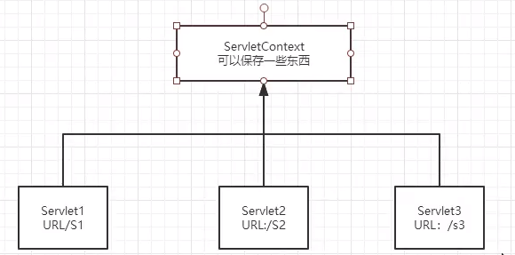

# JavaWeb

## 1 基本概念

### 1.1 前言

web 开发：

+ web 网页 资源的访问
  

+ 静态 web：
  + html css 
  + 提供给所有人看的数据始终不会变化
    

+ 动态 web
    + 提供给所有人看到的数据都不一样，每个人看到的信息也会发生改变
    + servlet jsp asp php
    

在 java 中，动态 web 资源开发的技术统称为 JavaWeb

### 1.2 web 应用程序

可以提供浏览器访问的程序

+ a.html b.html ... 多个 web 资源，这些 web 资源可以被外界访问，对外界提供服务


+ URL 统一资源定位符


+ 这些统一的 web 资源会被放到一个文件夹下 --> web 应用 --> tomcat 服务器


+ 一个 web 应用由多部分组成
    + html css js
    + jsp servlet
    + java 程序
    + jar 包
    + properties
    

+ web 程序写完后需要服务器统一管理才能被外部访问


### 1.3 静态 web

+ *.htm *.html 能通过浏览器直接读取

+ 请求 request ~ 响应 response

+ 缺点
    + web 页面无法动态更新，所有用户看到的都是同一个页面
        + 轮播图，点击特效：伪动态
        + javaScript
        + VBScript
    + 无法和数据库交互（数据无法持久化，用户无法交互），注册都费劲
    

### 1.4 动态 web

页面会动态展示，千人千面

+ 缺点
    + 如果 web 动态资源错误，我们需要重新编写后台程序，重新发布，停机维护
    

+ 优点
    + 可以动态更新
    + 可以与数据库交互，数据持久化（用户信息、商品信息 ...）
  
  
## 2 web 服务器

### 2.1 几个技术

+ ASP：在 html 中嵌入了 VB 的脚本
```html
<h1>
    <% java 代码 %>
</h1>
```
+ C#


+ IIS


+ php：开发速度快，功能强大，跨平台，代码很简单，缺点是无法承载大访问量


+ JSP / Servlet
    + sun 公司主推的 bs 架构 
    + 基于 java 语言
    + 可以承载高并发高可用高性能
    + 语法像 ASP
    

### 2.2 web 服务器

是一种被动的操作，用来处理用户的一些请求和给用户一些响应信息

+ IIS
  
微软的，windows 中自带的


+ Tomcat (>^ω^<)

Apache、免费、性能稳定、处理静态和动态、最新版本为 10.0

下载 tomcat：
1. 安装 / 解压
2. 了解配置文件和目录结构
3. 了解它的作用

## 3 Tomcat

### 3.1 安装

[tomcat 官网](http://tomcat.apache.org/)

[download tomcat10](https://tomcat.apache.org/download-10.cgi)

这里是 windows 系统，所以下载 [64-bit Windows zip (pgp, sha512)](https://mirrors.tuna.tsinghua.edu.cn/apache/tomcat/tomcat-10/v10.0.10/bin/apache-tomcat-10.0.10-windows-x64.zip)

无需安装 解压之后直接就能使用

### 3.2 启动

+ 启动

apache-tomcat-10.0.10/bin/startup.bat

成功访问 http://localhost:8080/ 说明 启动完毕

但是启动之后控制台出现乱码，默认不支持汉字？

将 apache-tomcat-10.0.10/conf/logging.properties 中所有的的 `encoding = UTF-8` 的都改为 `encoding = GBK`，问题解决

+ 关闭

apache-tomcat-10.0.10/bin/shutdown.bat 或 直接点 × 关闭 tomcat 窗口

+ 可能遇到的问题
    + 闪退
        1. java 环境变量没有配置
        2. 需要配置兼容性
    + 乱码：已解决

### 3.3 配置

核心配置文件：apache-tomcat-10.0.10/conf/server.xml

可以配置：
1. host 和 webapp
```xml
<Host name="localhost"  appBase="webapps"
            unpackWARs="true" autoDeploy="true" />
```
系统文件 etc/hosts 也要对应添加修改

2. port
```xml
<Connector port="8080" protocol="HTTP/1.1"
               connectionTimeout="20000"
               redirectPort="8443" />
```

3. 配置环境变量

### 3.4 发布一个 web 网站

+ 静态网页


+ 将自己写的网站，放到服务器（tomcat）中指定的 web 应用的文件夹（webapps）下，就可以访问了


+ 目录结构
```bash
--webapps
  --root
  --weiyupeng
    --WEB-INF
      --classes (*.java)
      --lib (dependencies.jar)
      --web.xml
    --index.html (默认的首页)
    --*.html
    --*.jsp
    --static
      --css
        --style.css
      --js
      --img
```

## 4 HTTP

### 4.1 what

超文本传输协议，一个简单的请求-响应协议，通常运行在 TCP 之上

+ HTTPS

安全


### 4.2 http 1.0 和 1.1

+ 1.0

客户端与服务器连接后，只能获取一个 web 资源，然后断开连接


+ 1.1

能获取多个 web 资源，长连接


### 4.3 request

+ 客户端 -- 发请求 -- 服务器

```bash
Request URL: https://www.baidu.com/ # 地址
Request Method: GET # 方法 GET POST
Status Code: 200 OK # 状态码
Remote Address: 110.242.68.3:443 # 地址:端口
Referrer Policy: no-referrer-when-downgrade
```

```bash
Accept: text/html,application/xhtml+xml,application/xml;q=0.9,image/webp,image/apng,*/*;q=0.8,application/signed-exchange;v=b3
Accept-Encoding: gzip, deflate, br # 编码方式
Accept-Language: zh-CN,zh;q=0.9  # 语言地区
Cache-Control: max-age=0
Connection: keep-alive # 长连接
Cookie: BIDUPSID=9D91478CB9860241F2EA424D1952CDB0; PSTM=1567840620; H_WISE_SIDS=148078_152522_155383_149355_152055_156818_156287_150775_154258_155985_148867_155225_154804_157765_153628_156622_157263_146870_150772_156388_156580_156516_127969_154413_154174_155962_152982_146732_155791_131423_155835_157699_128700_157781_155529_107314_156561_156945_155344_156745_157858_157790_144966_153535_154214_157814_156099_158089_156293_156442_153448_158126_157696_154639_152310_154353_110085_157006; hide_hotsearch=1; sug=3; ORIGIN=2; bdime=0; __yjs_duid=1_2bd10527b8c90f0afd0f46f979ee9e5d1618033482207; BAIDUID=FE413E712CF6CA121B6D802425FFFD4D:FG=1; MCITY=-%3A; BD_UPN=12314753; BDUSS=hOSnFjUXVnLWx0QjFvflBZWjM4bk1qU2RGT0NEd1puMmxxM2ZMTGRDNkdiQlJoRVFBQUFBJCQAAAAAAAAAAAEAAAAyCQFLS3JQZXJmZWN0AAAAAAAAAAAAAAAAAAAAAAAAAAAAAAAAAAAAAAAAAAAAAAAAAAAAAAAAAAAAAAAAAAAAAAAAAIbf7GCG3-xgUE; BDUSS_BFESS=hOSnFjUXVnLWx0QjFvflBZWjM4bk1qU2RGT0NEd1puMmxxM2ZMTGRDNkdiQlJoRVFBQUFBJCQAAAAAAAAAAAEAAAAyCQFLS3JQZXJmZWN0AAAAAAAAAAAAAAAAAAAAAAAAAAAAAAAAAAAAAAAAAAAAAAAAAAAAAAAAAAAAAAAAAAAAAAAAAIbf7GCG3-xgUE; BDSFRCVID_BFESS=mKuOJeC62ukSa6JHLUWFuy7VqUWP-vRTH6aoe28GcLucW1JvfBdCEG0PVU8g0Ku-JGz_ogKK0mOTHUkF_2uxOjjg8UtVJeC6EG0Ptf8g0M5; H_BDCLCKID_SF_BFESS=tb-qVCLKJKvhDRTvhCcjh-FSMgTBKI62aKDsWlvaBhcqEIL45tR6-jKpy-vPLM5tMRvpQx56LT6-VxbSj4QobjjbQUbr-4JUtmQq0qoe0h5nhMJK3j7JDMP0qt6xhqRy523ion6vQpnljpQ3DRoWXPIqbN7P-p5Z5mAqKl0MLPbtbb0xXj_0-nDSHH8qt6-H3e; BDORZ=B490B5EBF6F3CD402E515D22BCDA1598; __yjs_st=2_NzRmMzI4NThiM2QyZTVhNDYyNDUzY2UwNzg4ZGMxMWE2ZTc1NzYyZWE1ZTIxNzBlYTBmZGFmMGM3NzUxY2I2MTFiMTQxYjYyOTEyYzRkOGVmNTkwODNlNzU5MjE2ZTRjNDU1OGJhOTA1ZmYzZmNjYTQxMGJlYzEyMTdiZWMzZTU5YWVmNTA1MWYzNjZiZmY4ZjFmMTg2YjQwZjE1MzJjYzRhZTgyNGI3NmI1YTViZjcxZmZjYzZjNzJjYzZjOTkwOWEwM2UzN2ZlNTQ3YTFjYjM5OWE0MGU2OTU4M2JmYTQxOWVhMmI4ZmM5NmRlNDIzZmRiZjFiNzIzN2U5NTliMGQ5OWQ4YWE5NmI1MDVhZTMxMzc1NmY1YjQzOWY2ZDk2XzdfMzhlYTA3YzU=; BD_HOME=1; H_PS_PSSID=34436_31253_34377_33848_34449_34073_34092_26350_34245_34368; sugstore=0; BA_HECTOR=252h2k81210h00aklh1ghq0a60q
Host: www.baidu.com # 主机
Sec-Fetch-Mode: navigate
Sec-Fetch-Site: none
Sec-Fetch-User: ?1
Upgrade-Insecure-Requests: 1
User-Agent: Mozilla/5.0 (Windows NT 10.0; Win64; x64) AppleWebKit/537.36 (KHTML, like Gecko) Chrome/77.0.3865.90 Safari/537.36
```
+ 请求行

请求方式 GET POST HEAD DELETE PUT TRACE ...

GET：携带的参数较少，大小有限制，会在 URL 地址栏显示数据内容，不安全但高效

POST：携带的参数较多，大小没有限制，不会在 URL 地址栏显示数据内容，安全

+ 消息头

```bash
Accept: 告诉浏览器支持的数据类型
Accept-Encoding: 支持哪种编码格式 GBK UTF-8 GB2312 ISO8859-1
Accept-Language: 语言环境
Cache-Control: 缓存控制
Connection: 请求完成后是断开还是保持连接
...
```

### 4.4 request

+ 服务器 -- 发响应 -- 客户端

```bash
Bdpagetype: 2
Bdqid: 0xfb508de000022e0c
Cache-Control: private # 缓存控制
Connection: keep-alive # 连接 保持长连接
Content-Encoding: gzip # 压缩方式
Content-Type: text/html;charset=utf-8 # 编码方式
Date: Wed, 18 Aug 2021 12:49:02 GMT
Expires: Wed, 18 Aug 2021 12:49:01 GMT
Server: BWS/1.1
Set-Cookie: BDSVRTM=287; path=/
Set-Cookie: BD_HOME=1; path=/
Set-Cookie: H_PS_PSSID=34436_31253_34377_33848_34449_34073_34092_26350_34245_34368; path=/; domain=.baidu.com
Strict-Transport-Security: max-age=172800
Traceid: 1629290942353161447418109130094869097996
Transfer-Encoding: chunked
X-Frame-Options: sameorigin
X-Ua-Compatible: IE=Edge,chrome=1
```

+ 响应体

和 request 中的消息头字段一样，独有的如下

```bash
Reflesh: 告诉客户端多久刷新一次
Location: 让网页重新定位
```

+ 响应状态码

200：OK

3xx：重定向

4xx：找不到资源 404

5xx：服务器错误 500(服务器拉了) 502(网关错误)

## 5 Maven

项目架构管理工具，方便导入 jar 包

### 5.1 Maven

核心思想：约定大于配置

maven 会规定目录结构好如何编写 java

### 5.2 安装

官网：[https://maven.apache.org/](https://maven.apache.org/)

windows 版下载地址：[apache-maven-3.8.2-bin.zip](https://mirrors.bfsu.edu.cn/apache/maven/maven-3/3.8.2/binaries/apache-maven-3.8.2-bin.zip)

下载完解压即可

### 5.3 配置

+ 配置 mirror：apache-maven-3.8.2/conf/settings.xml，加快下载速度

随便百度一个就行


+ 配置环境变量
    + M2_HOME：`D:\apache-maven-3.8.2\bin`
    + MAVEN_HOME：`D:\apache-maven-3.8.2`
    + Path：`%MAVEN_HOME%\bin`

```bash
C:\Users\Administrator>mvn -version
Apache Maven 3.8.2 (ea98e05a04480131370aa0c110b8c54cf726c06f)
Maven home: D:\apache-maven-3.8.2
Java version: 1.8.0_181, vendor: Oracle Corporation, runtime: D:\jdk8\jre
Default locale: zh_CN, platform encoding: GBK
OS name: "windows 10", version: "10.0", arch: "amd64", family: "windows"
```

### 5.4 本地仓库

打开 apache-maven-3.8.2/conf/settings.xml 能查看默认仓库地址

```
  <!-- localRepository
   | The path to the local repository maven will use to store artifacts.
   |
   | Default: ${user.home}/.m2/repository
  <localRepository>/path/to/local/repo</localRepository>
  -->
```

新建一个文件夹当仓库，然后设置
```xml
  <localRepository>D:\apache-maven-3.8.2\weiyupeng-repo</localRepository>
```

### 5.5 IDEA 中使用 Maven

+ bug：maven 下载依赖时 501, ReasonPhrase:HTTPS Required

在 setting.xml 中将镜像 url 中的 http 改为 https

+ 项目创建之后

本地仓库会多一堆东西


+ 添加 web 模板


+ 配置 tomcat


+ 启动

bug：
```
类型 状态报告
消息 请求的资源[/weiyupeng-01/]不可用
描述 源服务器未能找到目标资源的表示或者是不愿公开一个已经存在的资源表示。
```

目录结构不对，web 文件夹是和 src 平起平坐的

### 5.6 pom.xml

```xml
<?xml version="1.0" encoding="UTF-8"?>

<!--头文件-->
<project xmlns="http://maven.apache.org/POM/4.0.0"
         xmlns:xsi="http://www.w3.org/2001/XMLSchema-instance"
         xsi:schemaLocation="http://maven.apache.org/POM/4.0.0 http://maven.apache.org/xsd/maven-4.0.0.xsd">
    <modelVersion>4.0.0</modelVersion>

    <!--GAV-->
    <groupId>cn.weiyupeng</groupId>
    <artifactId>javaweb</artifactId>
    <packaging>pom</packaging>
    <version>1.0</version>
    <modules>
        <module>javaweb-01-maven</module>
    </modules>

    <!--配置-->
    <properties>
        <maven.compiler.source>8</maven.compiler.source>
        <maven.compiler.target>8</maven.compiler.target>
    </properties>

    <!--依赖-->
    <dependencies>

    </dependencies>
    
    <!--构建用的，比如插件就在这里边-->
    <build>
            
    </build>
</project>
```

maven 会帮我们导入所依赖的所有 jar 包

```xml
<build>
        <!-- 在 build 中配置 resources，来防止资源导出失败的问题 -->
        <resources>
            <resource>
                <directory>src/main/resources</directory>
                <excludes>
                    <exclude>**/*.properties</exclude>
                    <exclude>**/*.xml</exclude>
                </excludes>
                <filtering>false</filtering>
            </resource>
            <resource>
                <directory>src/main/java</directory>
                <excludes>
                    <exclude>**/*.properties</exclude>
                    <exclude>**/*.xml</exclude>
                </excludes>
                <filtering>false</filtering>
            </resource>
        </resources>
    </build>
```

### 6 Servlet

### 6.1 what

+ sun 公司开发动态 web 的一门技术


+ sun 公司在这些 API 中提供一个接口叫 Servlet，使用它需要两步
  + 实现 Servlet 接口
  + 部署到 web 服务器中
  

### 6.2 Hello Servlet

1. 构建一个 maven 项目，导入依赖

```xml
        <!-- https://mvnrepository.com/artifact/javax.servlet/javax.servlet-api -->
        <dependency>
            <groupId>javax.servlet</groupId>
            <artifactId>javax.servlet-api</artifactId>
            <version>4.0.1</version>
            <scope>provided</scope>
        </dependency>
        <!-- https://mvnrepository.com/artifact/javax.servlet.jsp/javax.servlet.jsp-api -->
        <dependency>
            <groupId>javax.servlet.jsp</groupId>
            <artifactId>javax.servlet.jsp-api</artifactId>
            <version>2.3.1</version>
            <scope>provided</scope>
        </dependency>
```

2. 再建项目可以建子项目 module，继承了 parent 项目的 pom


新建项目时的 bug：
```bash
[ERROR] Error executing Maven.
[ERROR] 2 problems were encountered while building the effective settings
[FATAL] Non-parseable settings D:\apache-maven-3.8.2\conf\settings.xml: expected START_TAG or END_TAG not TEXT (position: TEXT seen ...</url>\r\n    </mirror>-->\r\n    <m... @183:7)  @ D:\apache-maven-3.8.2\conf\settings.xml, line 183, column 7
[FATAL] Non-parseable settings D:\apache-maven-3.8.2\conf\settings.xml: expected START_TAG or END_TAG not TEXT (position: TEXT seen ...</url>\r\n    </mirror>-->\r\n    <m... @183:7)  @ D:\apache-maven-3.8.2\conf\settings.xml, line 183, column 7
```
解决：按 FATAL 提示，发现配置 mirror 时有语法错误


3. 父项目多了

```xml
    <modules>
        <module>javaweb-01-maven</module>
        <module>servlet-01</module>
    </modules>
```
4. 子项目多了
```xml
    <parent>
        <artifactId>servlet</artifactId>
        <groupId>cn.weiyupeng</groupId>
        <version>1.0</version>
    </parent>
```

5. 手动添加目录


这也太智能了


6. 编写一个 Servlet
    1. 创建一个类
    2. 继承 HttpServlet: 抽象类 HttpServlet => 抽象类 GenericServlet => 接口 Servlet
    3. 重写方法 doGet doPost
    
```java
    @Override
    protected void doGet(HttpServletRequest req, HttpServletResponse resp) throws ServletException, IOException {
        PrintWriter writer = resp.getWriter(); // 响应流
        writer.print("Hello Servlet");
    }
```

7. 编写 Servlet 的映射

为什么需要映射：我们写的是 JAVA 程序，但是要通过浏览器访问，而浏览器需要连接web服务器，所以我们需要再web服务中注册我们写的 Servlet，还需给他一个浏览器能够访问的路径

在 web.xml 中配置映射
```xml
    <servlet>
        <servlet-name>hello</servlet-name>
        <servlet-class>cn.weiyupeng.servlet.HelloServlet</servlet-class>
    </servlet>
    <servlet-mapping>
        <servlet-name>hello</servlet-name>
        <url-pattern>/hello</url-pattern>
    </servlet-mapping>
```

8. 配置 tomcat


9. 启动测试

主页正常


但是访问 http://localhost:8080/servlet_01_war_exploded/hello 时，
实例化Servlet类[cn.weiyupeng.servlet.HelloServlet]异常

原因：Tomcat 和 Servlet 版本不对应


解决：将 tomcat 换成 9 


控制台打印出：

```bash
this is doGet method
```

浏览器响应：
```bash
HTTP/1.1 200
Content-Length: 13
Date: Sat, 21 Aug 2021 01:17:58 GMT
Keep-Alive: timeout=20
Connection: keep-alive
```

### 6.3 运行原理

Servlet 是由 web 服务器调用，web 服务器在收到浏览器请求之后


### 6.4 Mapping

1. 一个 Servlet 可以指定一个或多个 Mapping

2. Mapping 里可以写正则，比如 `*` `**/*` `*.weiyupeng`，注意：`*` 前边不能加任何路径，`/` 也不行

3. 优先级：优先找固定的绝对路径，找不到再走默认

```xml
    <!--404-->
    <servlet>
        <servlet-name>error</servlet-name>
        <servlet-class>cn.weiyupeng.servlet.ErrorServlet</servlet-class>
    </servlet>
    <servlet-mapping>
        <servlet-name>error</servlet-name>
        <url-pattern>/*</url-pattern>
    </servlet-mapping>
```

### 6.5 ServletContext

web 容器在启动的时候，会为每个 web 程序都创建一个 ServletContext 对象，它代表了当前的 web 应用

ServletContext 是全局的，一个 web 里只有一个 ServletContext



1. 共享数据

在一个 Servlet 的数据能被另一个 Servlet 访问

代码：servlet-02 中的 HelloServlet 和 GetServlet


执行 Hello 的 get 操作之后


2. 获取初始化参数

```xml
    <!--配置 web 的初始化参数-->
    <context-param>
        <param-name>url</param-name>
        <param-value>jdbc:mysql://localhost:3306/mybatis</param-value>
    </context-param>
```

代码：servlet-02 中的 ServletDemo03

```xml
    <servlet>
        <servlet-name>getParam</servlet-name>
        <servlet-class>cn.weiyupeng.servlet.ServletDemo03</servlet-class>
    </servlet>
    <servlet-mapping>
        <servlet-name>getParam</servlet-name>
        <url-pattern>/getParam</url-pattern>
    </servlet-mapping>
```


3. 请求转发

代码：servlet-02 中的 ServletDemo04

getRequestDispatcher 转发后，路径不变，但页面变了


4. 读取资源文件

Properties

在 java 目录和 resources 目录下新建 properties，都被打包到同一个路径下 classes，俗称 classpath

资源：resources/db.properties

代码：servlet-02 中的 ServletDemo05

```java
protected void doGet(HttpServletRequest req, HttpServletResponse resp) throws ServletException, IOException {
    ServletContext servletContext = this.getServletContext();
    InputStream resourceAsStream = servletContext.getResourceAsStream("WEB-INF/classes/db.properties"); // 得到文件流
    Properties properties = new Properties();
    properties.load(resourceAsStream);
    String userName = properties.getProperty("username");
    String password = properties.getProperty("password");

    resp.getWriter().print("user: " + userName + ", pwd: " + password);
}
```

### 6.6 HttpServletResponse

web 服务器接收到客户端的 http 请求，针对这个请求分别创建一个代表请求的 HttpServletRequest 对象和代表响应的一个 HttpServletResponse 对象

+ 如果要获取客户端请求过来的参数：找 HttpServletRequest

+ 如果给客户端一些响应：找 HttpServletResponse


+ 里边的内容包括

1. 负责向浏览器发送数据的方法
```java
ServletOutPutStream getOutPutStream();
PrintWriter getWriter();
```
2. 负责向浏览器发送响应头的方法
```java
void setCharacterEncoding(string var1);
void setContentLength(int var1) ;
void setContentLengthLong(long var1) ;
void setContentType(String var1);
void setDateHeader(String var1， Long var2) ;
void addDateHeader(String var1，Long var2) ;
void setHeader(String var1，String var2);
void addHeader(String var1，String var2);
void setIntHeader(String var1, int var2);
void addIntHeader(String var1,int var2);
```
3. 状态码 ~ 从 100 到 505


+ 常见应用

1. 向浏览器输出消息
       
2. 下载文件 代码：response 中的 FileServlet
    1. 要下载文件的 path
    2. 想办法让浏览器支持下载我们需要的东西
    3. 获取下载文件的输入流
    4. 创建缓冲区
    5. 获取 OutPutStream 对象
    6. 将 FileOutPutStream 写入到 buffer 缓冲区
    7. 使用 OutPutStream 将缓冲区中的数据输出到客户端
    
3. 验证码功能

+ 前端实现

+ 后端实现：需要用到 Java 图片类，生产一个图片


4. 实现重定向

一句话：`resp.sendRedirect("/response_war_exploded/image");`，相当于


重定向与转发？
```bash
相同点: 页面都会实现跳转
不同点: 重定向时 URL 会发生变化
```

### 6.7 HttpServletRequest

HttpServletRequest 代表客户端的请求，用户通过 http 访问服务器，http 请求中的所有信息会被封装到这里

HttpServletRequest 有一堆 getXxx 方法，通过这些方法获取请求的信息


```java
// 处理请求
String username = req.getParameter("username");
String password = req.getParameter("password");
System.out.println(username + ": " + password);
// 重定向时候一定要注意路径，否则 404
resp.sendRedirect("/response_war_exploded/userProfile.jsp");
```

+ 常见应用

1. 获取前端传递的参数，请求转发

代码：request 包中的 LoginServlet

```bash
Request URL: http://localhost:8080/request_war_exploded/login
Request Method: POST
Status Code: 200 
Remote Address: [::1]:8080
Referrer Policy: no-referrer-when-downgrade
```

2. 请求转发 & 重定向

```bash
相同点: 页面都会实现跳转
不同点: 1.重定向 302 URL 会发生变化 2.转发 307 URL 不会发生变化
```

```java
// 转发: 默认当前相对路径
req.getRequestDispatcher("/success.jsp").forward(req, resp);
// 重定向: 得写全了
resp.sendRedirect(req.getContextPath() + "/success.jsp");
```

## 7 Cookie Session

### 7.1 会话

一次会话：用户打开一个浏览器，点击了很多链接，访问了多个 web 资源，关闭浏览器

有状态会话：一个客户端访问服务端后，下次访问时服务端知道客户端是谁

### 7.2 保存会话的两种方式

+ cookie

客户端技术（响应，请求）

从请求中拿到 cookie，服务器响应给客户端 cookie

代码：cookie 包中的 CookieDemo01

cookie 一般会保存在本地的用户目录下

+ 删除 cookie：
    1. 不设置有效期，关闭浏览器自动失效
    2. 设置有效时间为 0（其实默认就是 -1）
    

+ 编码解码（解决乱码）
```java
URLEncoder.encode("魏宇鹏", "utf-8");
URLDecoder.decode(cookie.getValue, "utf-8");
```
+ session

服务器技术，可以保存用户的会话信息，把信息或数据放到 session 中

服务器会为每一个用户创建一个 session 对象

一个 session 独占一个浏览器，只要浏览器没有关闭，这个 session 就存在

用户登录之后，整个网站都可以访问了

使用场景：1.网站登录之后，你下次不用再登录了，第二次访问直接就能登上
2.在网站中经常使用的数据，放在 Session 中，不用来回取了
3.购物车信息

代码：cookie 包中的 SessionDemo01

第一次进


第二次进


+ session 可以跨 Servlet，在一个 web 应用里共享


+ 删除与注销（注销==关闭浏览器）
```java
session.removeAttribute("name");
session.invalidate(); // 手动注销
```

```xml
    <!--设置 Session 默认失效时间-->
    <session-config>
        <!-- 15min 后 Session 失效（单位是分钟！） -->
        <session-timeout>15</session-timeout>
    </session-config>
```

## 8 JSP

jsp 页面可以嵌入 java 代码，所以可以为用户提供动态数据

D:\apache-tomcat-10.0.10\work\Catalina\localhost\ROOT\org\apache\jsp


代码：cookie 包中的 index_jsp.java

jsp 最终会被转换为 java 类

jsp 本质上就是继承 Servlet，帮助程序员封装了一堆东西，真 · 简单！


[JSP教程 - 查字典](https://www.runoob.com/jsp/jsp-tutorial.html)

```html
<body>
    <%
        String name = "weiyupeng";
    %>
    name: <%=name%>
</body>
```
这段代码，相当于 new 了一个 Servlet，并用 out.write() 写了出来


查看自动生成的 java 文件 C:\Users\Administrator\AppData\Local\JetBrains\IntelliJIdea2021.1\tomcat\19d17601-13ba-47fc-a951-2193a5f8cb85\work\Catalina\localhost\cookie_war_exploded\org\apache\jsp\hello_jsp.java


## 9 JavaBean

实体类

+ 特定的写法
    + 必须有一个无参构造
    + 属性必须私有化
    + 有对应的 get set 方法
    + 一般和数据库的字段做映射


+ ORM 对象关系映射
    + 表 --> 类
    + 字段 --> 属性
    + 行 --> 对象


## 10 Filter 过滤器

代码：filter 包

## 11 Servlet 数据库访问

代码：jdbc 包


